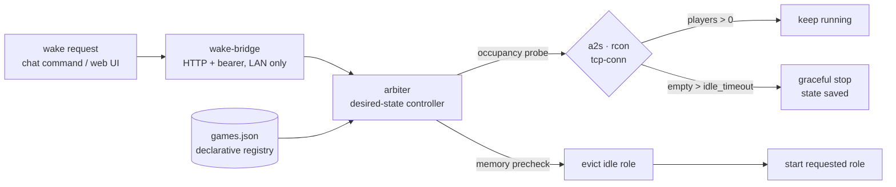

# role-arbiter


A resource controller for hosts that are short on memory and carry heavy
on-demand roles: game servers, a Windows lab, a virtual machine. Several may run
at the same time, for as long as the measured free memory carries them. When it
no longer does, this decides who gives way. It wakes the role that was asked for,
switches off the ones nobody is using, and refuses a request it could only grant
by throwing someone out of a running session.



## Why

Under memory pressure the kernel picks a process to kill. It has no idea whether
somebody was in the middle of using that process. Starting and stopping things by
hand avoids the problem, but then a person is the scheduler, and nothing is
available while that person is asleep.

So the host schedules itself, on four rules:

1. **Measured free memory decides, not a counter.** A start that fits changes
   nothing for anyone else. The first version allowed exactly one role at a time,
   which was simple and wrong: it put a small role to sleep to make room for
   another small role, on a host with gigabytes to spare.
2. **A role with people on it wins.** A wake request that could only be granted
   by displacing it is refused (exit code 3, logged for the notification path).
   There is no override. An earlier version had one, and a flag that exists gets
   used at the worst possible moment; the flag is gone, and passing it now aborts
   with an explicit message rather than being ignored in silence.
3. **Empty roles give way, longest idle first**, and get switched off entirely
   once `idle_timeout_s` has passed with nobody on them.
4. **A reservation protects a role that is momentarily empty.** Precisely because
   nobody is on it, an empty role looks like the ideal candidate to evict, which
   is exactly wrong while someone is working on it.

## Counting actual users

Switching something off automatically is only safe if the question "is anyone on
this right now" gets a real answer. Each role is probed in whatever way actually
returns a player count:

| Probe | When it is the right one |
|---|---|
| `a2s` | The service answers the game network's server query on a known port |
| `rcon` | The game protocol is UDP-only, but an admin console can be asked |
| `tcp-conn` | Neither exists: count established connections on the service port |

A fixed timer would cut people off mid-session. Checking whether the process is
alive would keep empty services running forever. Three probe types is more work
than one, and it is the only version that behaves correctly.

## Adding a role means editing a file

The first version had one service hard-wired into the controller. Adding the
second meant touching the control logic, which was already tedious at two roles.
Now they live in a JSON registry that the controller reads at startup:

```json
{ "games": [
  { "name": "valheim", "kind": "lxc-systemd", "ctid": 206, "service": "valheim-server",
    "probe": { "type": "a2s", "ip": "192.0.2.10", "port": 2457 },
    "min_free_mb": 4000, "idle_timeout_s": 1200 }
]}
```

`min_free_mb` is a per-role memory floor that gets checked before a start.
`idle_timeout_s` is how long a role may sit empty before it is switched off.

`kind` is what keeps the same controller usable on different hosts: a role can be
a systemd unit inside a container (`lxc-systemd`), a compose service inside one
(`lxc-docker`), or a plain unit on the host itself (`systemd`). Exactly one
function in the controller knows how to reach into a container; everything else
above it is written in terms of start, stop and "is anybody on this". That one
function was the whole porting effort when the roles moved from a hypervisor node
to a bare server.

## Shutting down without losing state

Several of these services handle `SIGTERM` badly and exit before their world
state is fully written, which would quietly cost progress on every eviction.
Those get explicit save and quit commands sent to the server console at stop
time. Afterwards I check the server log to confirm the save actually happened.

## Safety

- **Dry-run by default.** Without `--live` the controller only logs what it would do.
- **Graceful first.** VM shutdown goes through the hypervisor's shutdown path. A
  hard stop needs a separate confirmation flag.
- **One writer.** `flock` around the tick, atomic `state.json`, append-only audit log.
- **Base services are untouchable.** Anything outside the arbitrated set is never
  a candidate for eviction.
- **The bridge is not public.** `wake-bridge` binds to the local network and wants
  a bearer token. Only the read-only status endpoint is token-free.

## Layout

- `arbiter/arbiter.py`: the controller, with the tick loop, eviction policy, probes and state
- `arbiter/games.*.json`: the role registry, one file per host, deployed as `games.json`
- `arbiter/wake-bridge.py` + `.service`: HTTP trigger (`/wake`, `/sleep`, `/restart`, `/status`)
- `arbiter/mc-wake-on-join.py` + `.service`: wake-on-join daemon that follows proxy logs
- `mc-server/`: compose and proxy config for the Minecraft role
- `tests/arbiter-tests.sh`: precheck and policy tests
- `deploy.sh`: pushes controller, bridge and units to the node

Addresses and node names in this snapshot are placeholders. MIT licensed.

## About this snapshot

The private repository this comes from carries node names, addresses and the
compose files for the roles themselves. A script strips all of that, swaps
internal addresses and paths for placeholders, and refuses to push unless two
separate secret scanners come back clean.

That is also why there is a single commit rather than the real history. The
controller runs on my own node and gets maintained there.
